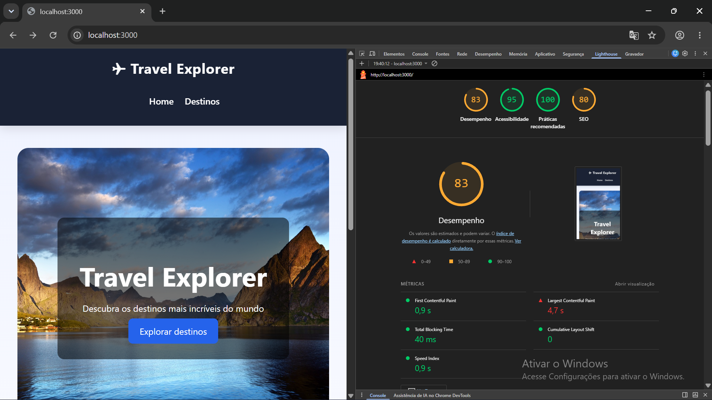
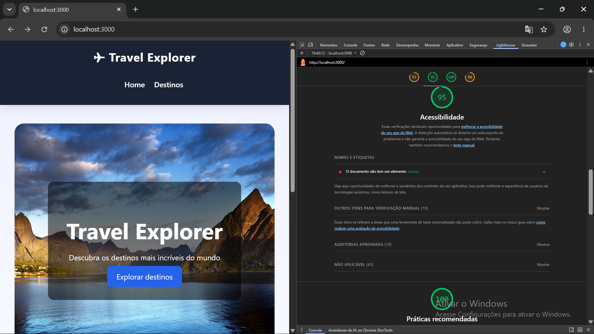
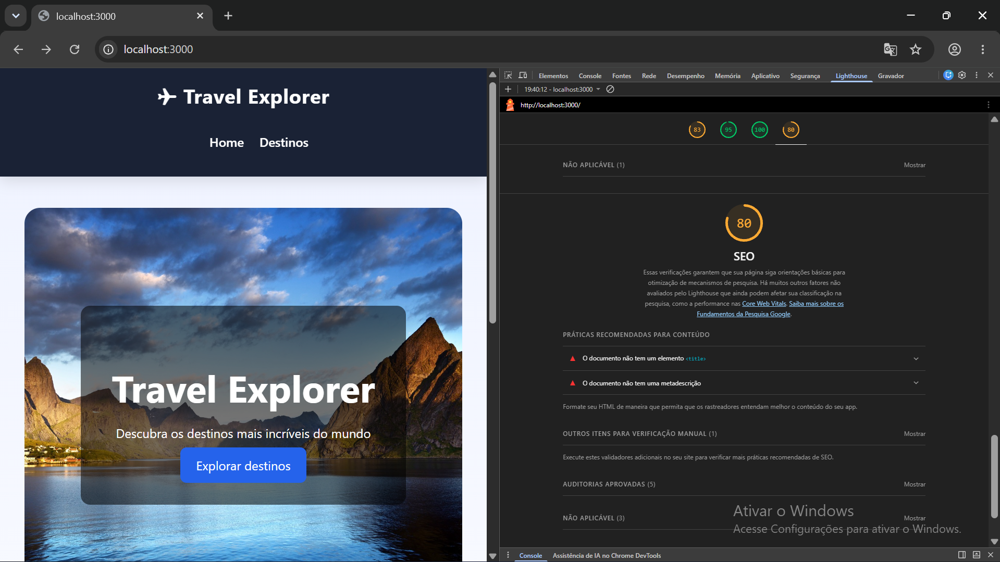
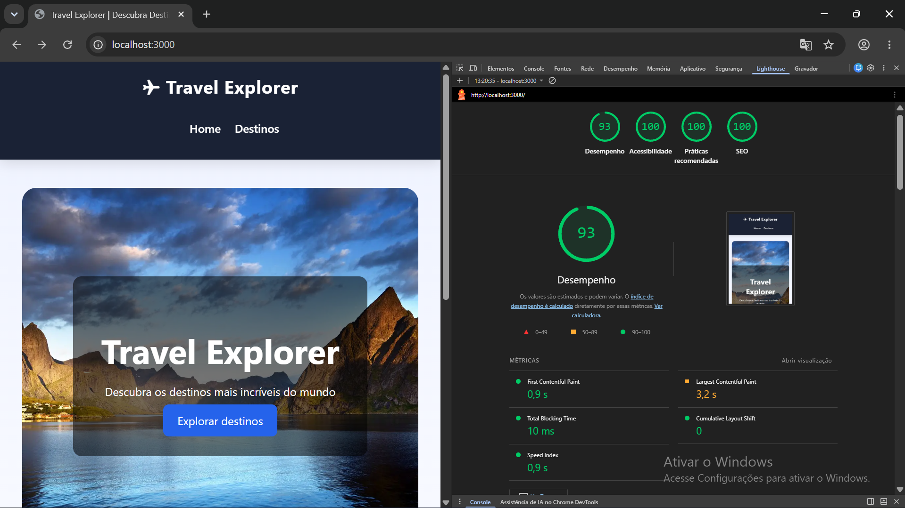
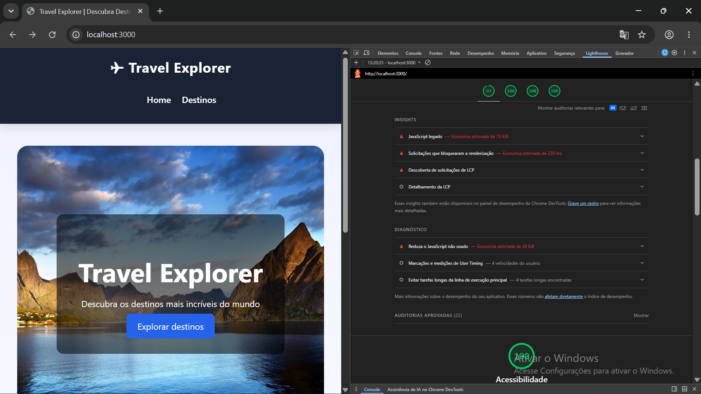
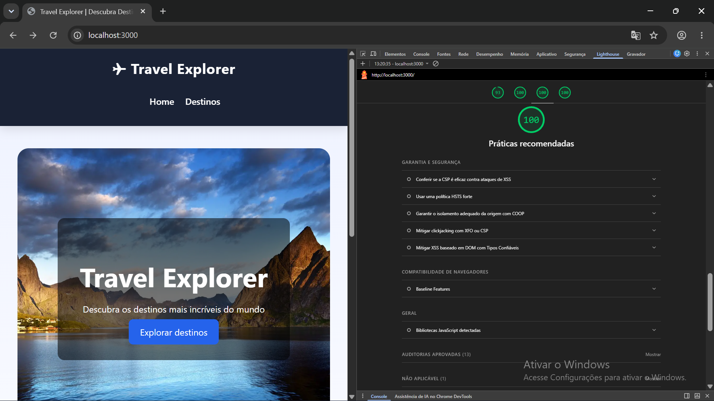
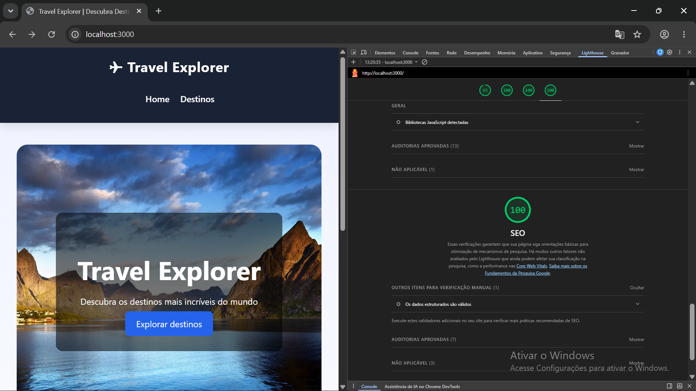

# ✈️ Travel Explorer

Projeto desenvolvido com **Next.js + TypeScript**, simulando um portal de viagens com listagem de destinos turísticos e páginas dinâmicas. Posteriormente, o projeto passou por uma etapa de **otimização de desempenho**, utilizando o Google Lighthouse como ferramenta de análise para identificar gargalos e aplicar melhorias sem alterar o layout ou a experiência visual da aplicação.

---

# 🚀 Demonstração

Aplicação desenvolvida para apresentar destinos turísticos por meio de uma interface moderna, com navegação dinâmica e páginas individuais para cada destino.

---

# 🧰 Tecnologias Utilizadas

* Next.js
* React
* TypeScript
* CSS Modules
* Next/Image
* Next/Link
* Google Lighthouse
* Squoosh

---

# 📁 Estrutura do Projeto

```text
src/
├── components/
├── data/
├── pages/
├── styles/

public/
└── images/
```

---

# 🌍 Funcionalidades

* Listagem de destinos turísticos.
* Página dinâmica para cada destino.
* Navegação utilizando Next.js.
* Componentização.
* Estilização com CSS Modules.
* Responsividade.
* SEO básico.
* Imagens otimizadas para melhor desempenho.

---

# ⚡ Atividade de Otimização de Performance

## Objetivo

Aplicar técnicas de otimização em um projeto já existente utilizando o Google Lighthouse para medir os resultados antes e depois das melhorias.

---

# 🔍 Análise Inicial

## Resultado do Lighthouse

| Métrica        |   Antes |
| -------------- | ------: |
| Performance    |  **83** |
| Accessibility  |  **95** |
| Best Practices | **100** |
| SEO            |  **80** |

### Métricas

| Indicador | Antes |
| --------- | ----: |
| FCP       | 0,9 s |
| LCP       | 4,7 s |
| TBT       | 40 ms |
| CLS       |     0 |

---

## 📷 Lighthouse (Antes)






---

# Gargalos Identificados

Durante a análise inicial foram encontrados os seguintes pontos de melhoria:

* Imagens em formato JPG com tamanho elevado.
* Ausência das tags `<title>` e `meta description`.
* Baixa pontuação em SEO.
* Oportunidade de reduzir o tempo do Largest Contentful Paint (LCP).
* Recursos CSS bloqueando parte da renderização inicial.
* Possibilidade de reduzir o tamanho das imagens.

---

# Melhorias Aplicadas

## ✅ Conversão das imagens para WebP

Todas as imagens utilizadas pelo projeto foram convertidas para o formato WebP, reduzindo significativamente o tamanho dos arquivos sem alterar a qualidade visual.

### Comparativo

| Imagem     |   Antes |      Depois |
| ---------- | ------: | ----------: |
| Hero       |  527 KB |  **178 KB** |
| Maldives   |  255 KB | **89,1 KB** |
| Montenegro |  232 KB |  **151 KB** |
| New York   |  148 KB | **98,6 KB** |
| Paris      |  220 KB |  **112 KB** |
| Rio        | 69,1 KB | **54,7 KB** |
| Tokyo      |  185 KB |  **157 KB** |

---

## ✅ Atualização dos caminhos das imagens

Após a conversão, todos os caminhos do projeto foram atualizados para utilizar os novos arquivos WebP.

---

## ✅ SEO

Foram adicionados:

* `<title>`
* `meta description`
* `meta keywords`
* `meta viewport`
* `theme-color`

---

## ✅ Configuração de Produção

Atualização do `next.config.ts` com:

* `compress`
* `poweredByHeader: false`
* suporte a WebP/AVIF

---

## ✅ Minificação

Foi gerada a versão de produção utilizando:

```bash
npm run build
```

A build de produção do Next.js realiza automaticamente a minificação dos arquivos HTML, CSS e JavaScript.

---

## ✅ Revisão do Código

Foi realizada uma revisão geral para identificar imports, funções e estilos não utilizados.

Não foram encontrados trechos relevantes que justificassem remoção sem alterar o comportamento da aplicação.

---

# 📊 Resultado Final

## Lighthouse

| Métrica        |   Antes |  Depois |
| -------------- | ------: | ------: |
| Performance    |  **83** |  **93** |
| Accessibility  |  **95** | **100** |
| Best Practices | **100** | **100** |
| SEO            |  **80** | **100** |

---

## Métricas

| Indicador | Antes |    Depois |
| --------- | ----: | --------: |
| FCP       | 0,9 s |     0,9 s |
| LCP       | 4,7 s | **3,2 s** |
| TBT       | 40 ms | **10 ms** |
| CLS       |     0 |         0 |

---

## 📷 Lighthouse (Depois)






---

# 💬 Comparativo e Comentários

As otimizações foram realizadas preservando completamente a interface e a experiência visual do projeto.

Os principais ganhos obtidos foram:

* aumento da Performance de **83 para 93**;
* aumento da Accessibility de **95 para 100**;
* aumento do SEO de **80 para 100**;
* redução do LCP de **4,7 s para 3,2 s**;
* redução do TBT de **40 ms para 10 ms**.

A conversão das imagens para o formato WebP foi a melhoria que apresentou maior impacto, reduzindo significativamente o tamanho dos arquivos e contribuindo para um carregamento mais eficiente da aplicação. A inclusão das informações de SEO também elevou a pontuação do Lighthouse sem alterar o comportamento da interface.

---

# ▶️ Como Executar o Projeto

Instale as dependências:

```bash
npm install
```

Para executar em ambiente de desenvolvimento:

```bash
npm run dev
```

Para gerar a versão otimizada de produção:

```bash
npm run build
npm start
```

Acesse:

```text
http://localhost:3000
```

---

# 📌 Rotas

| Rota             | Descrição                   |
| ---------------- | --------------------------- |
| `/`              | Página inicial              |
| `/destinos`      | Lista de destinos           |
| `/destinos/[id]` | Página dinâmica de detalhes |

---

# 👨‍💻 Autor

**Gabriel Costa**

---

# 📄 Licença

Este projeto foi desenvolvido para fins educacionais como prática de desenvolvimento com Next.js e otimização de desempenho utilizando o Google Lighthouse.
